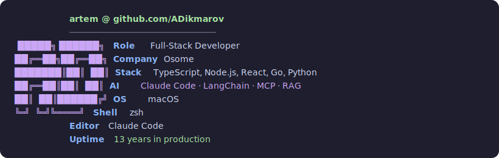
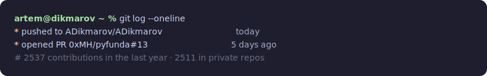
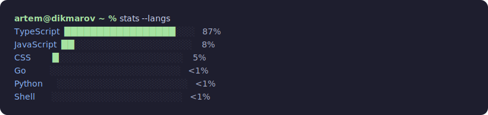

  <a href="https://instagram.com/tema_d_01">Instagram</a> ·
  <a href="https://www.linkedin.com/in/adikmarov/">LinkedIn</a> ·
  <a href="https://x.com/tema_d_01">X</a>

generated daily by <a href=".github/workflows/update-readme.yml">GitHub Actions</a> · no templates were harmed

